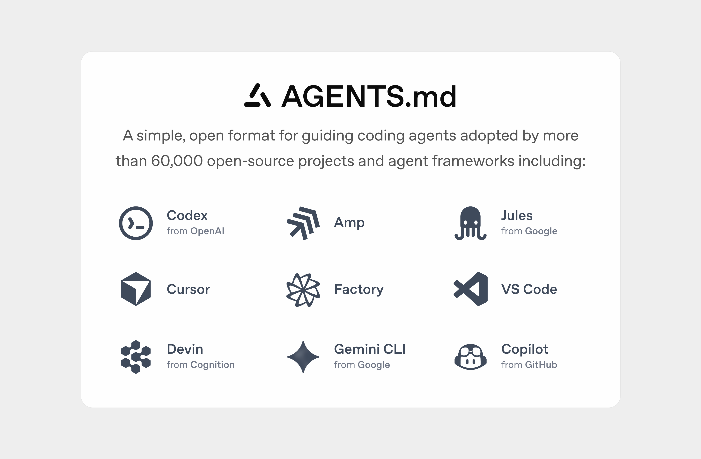

# AGENTS.md: Course 2 local starter



AGENTS.md is a simple, open format for giving coding agents useful project
instructions. This starter is a local Next.js website for practicing reusable
skills and focused review with Codex.

This lab is self-contained. Completing another course is not required. Git,
GitHub access, API keys, and external services are not required.

## Start the application

Open `codex-201-academy-lab` as a local project, then start the existing
development server:

```bash
pnpm dev
```

If the dependencies are missing, install the versions recorded in the lockfile
before starting the server:

```bash
pnpm install --frozen-lockfile
pnpm dev
```

Do not reinstall dependencies when `node_modules/.bin/next` and
`node_modules/.bin/tsc` already exist. Open the local URL reported by the
development server.

## Explore the prepared application

The starter already includes the Home, About, Contact, and Docs pages.

- `components/Navbar.tsx` contains the shared navigation.
- `components/ContentPage.tsx` contains the shared page layout and metadata.
- `pages/about.tsx`, `pages/contact.tsx`, and `pages/docs.tsx` show the
  existing page conventions.
- `AGENTS.md` contains project instructions and validation requirements.
- `output.txt` records the prepared application baseline.

The Resources and Guides pages and reusable page-delivery skill are
intentionally absent. You create them during the lab.

## Validate your changes

Run both existing project checks:

```bash
pnpm lint
pnpm typecheck
```

No automated test suite is included. Check changed routes, headings, page
titles, and navigation in the running application.
